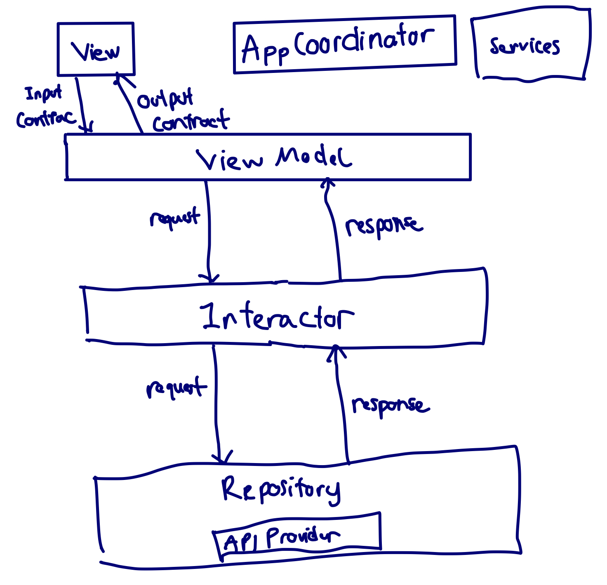

## Architecture
- This project was using the MVVM app architecture for `Presentation Layer`.
- Using Clean Architecture data flow
- Using Dependency injection pattern  
- Separate raw `Model` from API response with `Model` using in `View`
- Defined `Contract` for both Input/Output for each `Scene`
- Using `Cocoapods` as Packet Manager

#$ Project Structure
1. Target OpenWeatherClient
`Application`: contain `Appdelegate` and `SceneDelegate`
`Configurations`: contain `XCodeConfig` and `Info.plist`
`Factory`: `Dependencies` proxy using in app
`Component`: contain `Coordinator`, `Manager`, `Services` and `Constants` using in app
`Models`: Raw model from API response
`Scenes`: Scenes using in app
`Extensions`: category
`Resources`: resources using in app

2. OpenWeatherClientTests
`Configurations`: testing `Configurations`
`Factory`: contain Mock and testing `Dependencies`
`Scene`: contain testing all `Base` file and `WeatherForecastViewModel`

## Libraries
- `RxSwift`/`RxCocoa`: Reactive Programming in Swift
- `RxDataSources`: UITableView and UICollectionView Data Sources for RxSwift
- `RxKeyboard`: Reactive Keyboard in iOS
- `RxReachability`: RxSwift bindings for Reachability
- `Action`: Abstracts actions to be performed in RxSwift
- `SnapKit`: Autolayout DSL
- `Quick`: A BDD framework for Swift and Objective-C
- `Nimble`: A matcher framework for your tests
- `RxBlocking`/`RxTest`: Testing your Reactive code

## How to run on local computer
1. Install Xcode (MacOS)
1. Install `CocoaPods` by following guide: https://guides.cocoapods.org/
2. Open `Terminal` at root project dir
3. Type `pod install`
4. Launch `OpenWeatherClient.xcworkspace` and press `Run` button.

## Checklist
1. [x] Programming language: Swift is required, Objective-C is optional.
2. [x] Design app's architecture (recommend VIPER or MVP, MVVM but not mandatory)
3. [x] UI should be looks like in attachment.
4. [x] Write UnitTests
5. Acceptance Tests
6. [x] Exception handling
7. Caching handling
8. Accessibility for Disability Supports:
9. Entity relationship diagram for the database and solution diagrams for the components, infrastructure design if any
10. [x] Readme file includes
 
